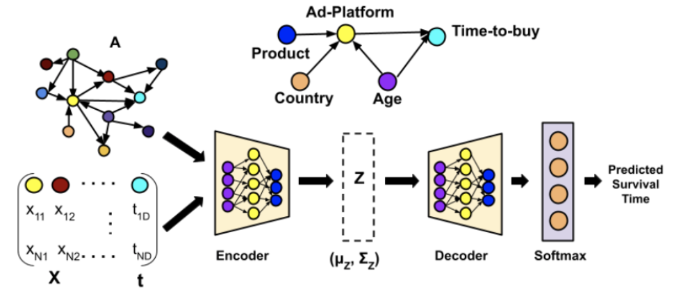

# DAGSurv

Survival analysis (SA) is a well-known statistical technique for the study of temporal events. In SA, time-to-an-event data is modeled using a parametric probabilistic function of fully or partially observed covariates.
All the existing technique for survival analysis assume that the covariates are statistically independent.
To integrate the cause-effect relationship between covariates and the time-to-event outcome, we present to you DAGSurv which encodes the causal DAG structure into the analysis of temporal data and eventually leads to better results (higher Concordance Index).

## Dependencies
This code requires the following key dependencies:
- Python 3.8
- torch==1.6.0
- pycox==0.2.1

## Usage
To train the DAGSurv model, please run the *main.py* as `python main.py`

There are a number of hyper-parameters present in the script which can be easily changed. 

## Experiments
We evaluated our approach on two real-world and two synthetic datasets; and used time-dependent Concordance Index(C-td) as our evaluation metric.

### Real-World Datasets
- METABRIC : The Molecular Taxonomy of Breast Cancer International Consor- tium (METABRIC) is a clinical dataset which consists of gene expressions used to determine different subgroups of breast cancer. We consider the data for 1,904 patients with each patient having 9 covariates. Furthermore, out of the total 1,904 patients, 801 (42.06%) are right-censored, and the rest are deceased (event).
- GBSG : Rotterdam and German Breast Cancer Study Group (GBSG) contains breast-cancer data from Rotterdam Tumor bank. The dataset consists of 2,232 patients out of which 965 (43.23%) are right-censored, remaining are deceased (event), and there were no missing values. In total, there were 7 features per patient.

### Time-Dependent Concordance Index(C-td)
We employ the time-dependent concordance index (CI) as our evaluation
metric since it is robust to changes in the survival risk over time.
Mathematically it is given as
$$\\begin{aligned}
  C\_{td} &= P\\left(F(t^{(i)}\|x^{(i)})>F(t^{(i)}\|x^{(j)})\|t^{(i)} \< t^{(j)}\\right) \\nonumber\\\\
  &\\approx \\frac{\\sum\_{i \\neq j} R\_{i,j}\\mathbb{1}\\left(F(t^{(i)}\|x^{(i)})>F(t^{(i)}\|x^{(j)})\\right)}{\\sum\_{i \\neq j} R\_{i,j}},\\end{aligned}$$
where 𝟙(.) is the indicator function and
$R\_{i,j} \\triangleeq\\mathbb{1}\\left(t^{(i)} \< t^{(j)}\\right)$,
i.e., we use an empirical estimate of the time-dependent CI as our
metric.

### Results
Here, we present our results on the two real-world datasets mentioned above - 

## Code References

[1] Yue Yu, Jie Chen, Tian Gao, Mo Yu. "DAG-GNN: DAG Structure Learning with Graph Neural Networks."
[2] 
